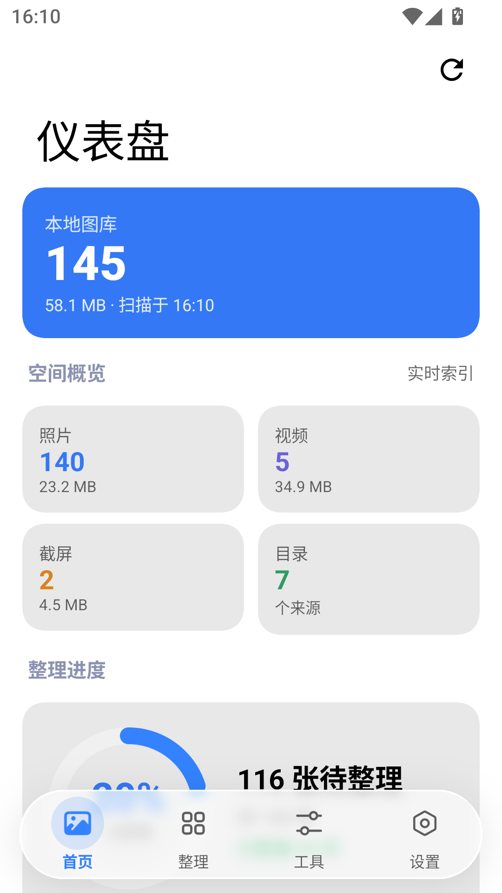
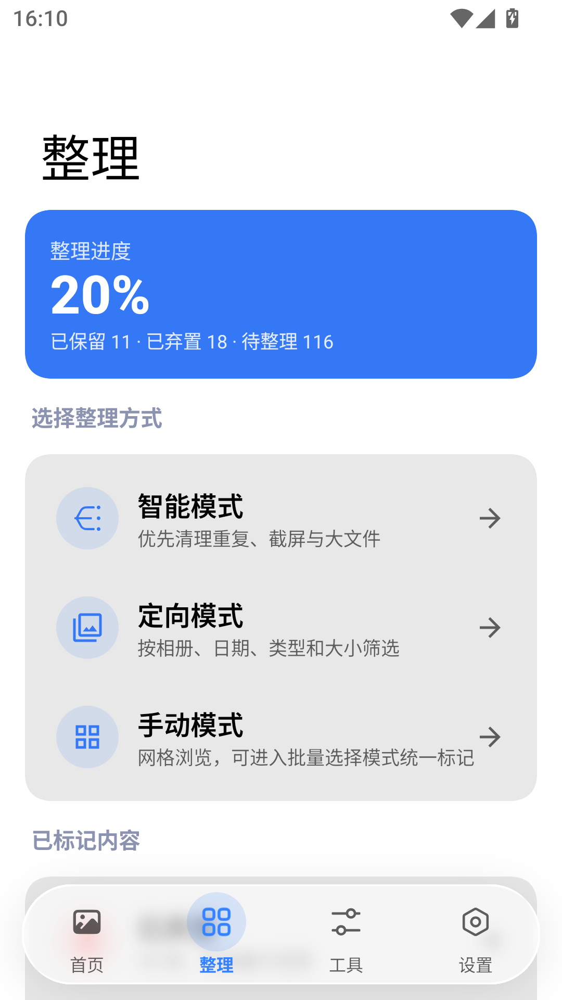
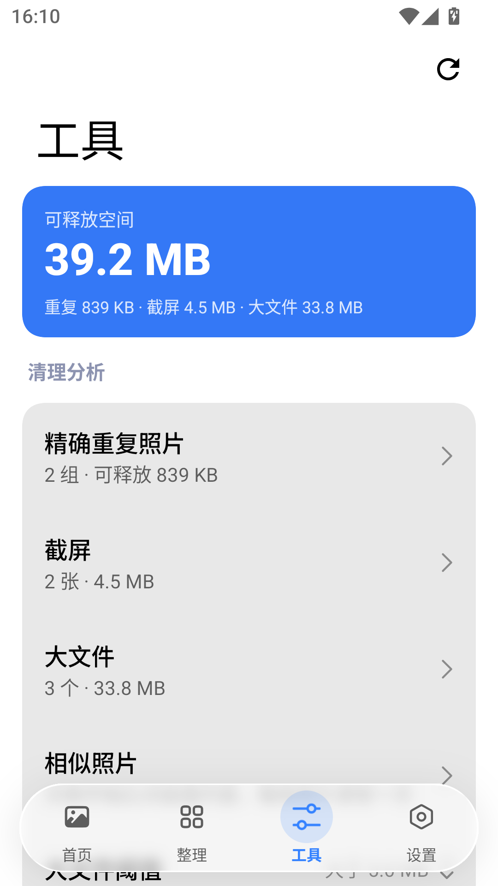
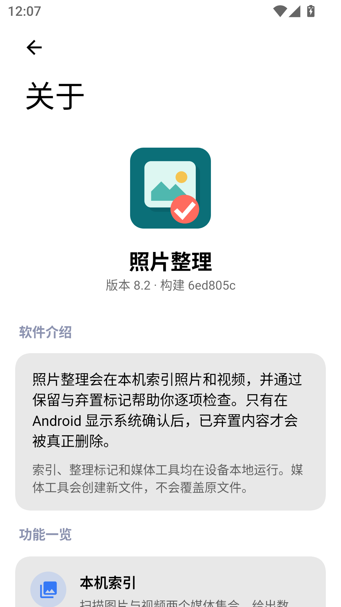

# 照片整理 · Photo Organizer

[](https://github.com/lswlc33/photo/actions/workflows/ci.yml)
[](https://github.com/lswlc33/photo/actions/workflows/pages.yml)

本地相册整理工具。扫描设备上的照片与视频，帮助逐张做出取舍，检出重复项、相似画面、截屏与大文件，并在本机完成压缩与重编码。

全部处理都在设备上进行：任何照片、缩略图或统计数据都不会离开设备。

应用只申请了一个与媒体无关的权限——`INTERNET`，仅用于**检查更新**，而那个开关**默认关闭**，关闭时应用不发起任何网络请求。它必须写在清单里而不能在运行时申请：`INTERNET` 是普通权限，Android 在安装时直接授予，没有询问这一步，所以能保证的是**不使用**而不是不持有。除更新检查之外，应用不连接任何服务，也没有统计分析或崩溃上报。

介绍页：<https://lswlc33.github.io/photo/> · 直接下载：[nightly 预发布](https://github.com/lswlc33/photo/releases/tag/nightly)

## 界面

| 首页 | 整理 | 工具 | 关于 |
|---|---|---|---|
|  |  |  |  |

## 功能

**首页** 媒体总量、照片/视频/截屏的数量与体积、来自几个目录、重复副本能省下多少，以及索引状态与部分授权提示。

**整理** 三种模式：

- **智能模式** —— 按"收益"排队：先问重复副本，再问截屏，再问大文件，最后是其余项目。
- **定向模式** —— 按相册、日期区间、类型（照片/视频/动态照片/截屏）与最小体积筛选后再评审。
- **手动模式** —— 分组网格，支持批量选择、统一标记与右侧快速滚动条。按日期排序时按天分组；按大小排序时先按月份分组，每月内部大文件在前——这样"最占空间的那些照片"才落在同一屏里，而不是被打散成一条全库长队。

评审结果分为「已保留」与「已弃置」两个集合，可随时回看。删除一律通过系统确认对话框执行，应用自身从不直接删除文件。另可把任意项目归入自建的「逻辑相册」，它只记录归属关系，不移动文件。

**工具** 顶部是「可释放空间」——重复副本、截屏、大文件三项的合计上限，重叠的文件只算一次。

- **精确重复** —— 先按字节大小分桶，只对同尺寸候选做 SHA-256，因此普通图库几乎不需要读盘。
- **相似照片** —— 感知哈希（dHash）检出连拍、重新编码或缩放后的同一画面。该项按需启动，因为需要解码每一张图片；过程可随时取消，结果会缓存到下次启动。
- **截屏** / **大文件** —— 阈值可在 5/10/20/50/100 MB 间选择。
- **媒体处理** —— 图片可转 JPEG/WebP/PNG、限制长边、调整质量、保留或清除 Exif；视频可选编码格式（沿用原编码/H.264/HEVC/AV1）、转 1080p/720p/480p、限制码率、仅保留视频或仅提取音频，HDR 与杜比视界默认跳过而不是压成 SDR。流程分四步：先设好输出、再从图库里挑文件（可按时间或大小排序）、看进度、最后左右对比每个结果——视频可长按同步播放。产物先留在临时目录，只有你勾选保留的才会写回**源文件所在的目录**，文件名沿用源文件并加上 `-z1` 这样的后缀记录压缩次数；**源文件永不修改**，是否删除会在最后单独询问，主按钮是「保留」。输出体积更大时自动放弃。

**设置** 主题（跟随系统/浅色/深色）、滑动动画、删除前确认、默认排序、图片与视频的默认质量、元数据处理，以及索引范围（全部相册／排除指定相册／仅指定相册）。「关于」页除版本信息外，还列出应用做什么、不做什么，以及用到的每一个第三方开源项目及其许可证。

## 下载与安装

当前版本 **v8.1**（`versionCode 9`）。

[nightly 预发布](https://github.com/lswlc33/photo/releases/tag/nightly)跟着 master 走：每次推送都自动构建，检查通过后把新的 APK 刷新到同一个位置。它是 **nightly 构建** —— 代码压缩、资源压缩、「不可调试」和签名密钥都和正式版一致（约 5 MB），区别只是它构建自 master 的任意一个提交。

安装时系统会问一次是否允许安装未知来源的应用。

正式版另发：打一个 `v` 开头的标签会触发一次构建，产物出现在 [Releases](https://github.com/lswlc33/photo/releases) 页。两者用同一把密钥，所以 nightly 与正式版之间可以直接覆盖安装，不需要卸载。

## 环境要求

| 项目 | 版本 |
|---|---|
| Android | 13 及以上（minSdk 33） |
| JDK | 17 |
| 编译目标 | compileSdk / targetSdk 37 |
| 界面 | Compose + [MIUIX](https://compose-miuix-ui.github.io/miuix/) + [Kyant Backdrop](https://kyant.gitbook.io/backdrop) |
| 视频转码 | Media3 Transformer（设备硬件编解码器，无原生依赖，全 ABI 可用） |

## 构建与运行

使用 Gradle wrapper，不要用本机安装的 Gradle：

```bash
./gradlew :app:assembleDebug     # 构建 debug APK
./gradlew :app:installDebug      # 安装到已连接的设备
./gradlew :app:assembleNightly   # 构建发布页上那个 APK
```

Windows 的 PowerShell / cmd 下用 `.\gradlew.bat`。

版本号在 `gradle.properties` 的 `photoVersionCode` / `photoVersionName` 里声明。

三个构建变体：`debug` 是本地开发用的，体积大且可调试；`release` 走完整的代码压缩，并且只在配好了发布密钥时才签名，否则产出装不上的未签名 APK；`nightly` 与 `release` 的配置完全相同（含签名密钥），只是构建自 master 的任意一个提交而不是标签，预发布页上的就是它。发布密钥怎么配见 `AGENTS.md`。

## 测试

```bash
./gradlew :app:test    # JVM 单元测试
./gradlew :app:lint    # Android lint
```

只跑某个类或某个方法：

```bash
./gradlew :app:testDebugUnitTest --tests 'com.lc33.photoorganizer.media.SmartQueueTest'
./gradlew :app:testDebugUnitTest --tests '*SmartQueueTest.sortsEachBucketByDescendingSize'
```

仪器测试会真实调用编解码器并写入 MediaStore，需要设备或模拟器：

```bash
./gradlew :app:connectedDebugAndroidTest
```

分析类逻辑刻意写成不依赖 Android 的纯 Kotlin，Android 部分作为 lambda 注入，因此绝大部分核心逻辑可以在 JVM 上测试。新增算法请沿用这个模式。

## 自动构建

| workflow | 触发 | 做什么 |
|---|---|---|
| `ci.yml` | 每次推送、PR | 检查提交信息语言，跑 test + lint + assembleNightly；master 上再把同一个 APK 刷新到 `nightly` 预发布 |
| `release.yml` | 推送 `v` 开头的标签 | 校验标签与 `photoVersionName` 一致，跑 test + lint，构建用发布密钥签名的 release APK，验过签名后发正式版 |
| `pages.yml` | `index.html` / `assets/` 变化 | 部署介绍页 |

只有 `release.yml` 需要配置密钥（四个 `PHOTO_RELEASE_*` secret，含义见 `AGENTS.md`）；另外两个只用运行时自带的 `GITHUB_TOKEN`。

## 代码结构

单模块 `:app`，包名 `com.lc33.photoorganizer`：

| 目录 | 职责 |
|---|---|
| `media/` | 领域层：MediaStore 索引、权限状态、筛选与范围、重复/相似分析、指纹缓存。尽量不引入 Compose 与 Android 依赖 |
| `processing/` | 图片与视频重编码，以及 MediaStore 产物写入 |
| `ui/` | 主题、系统内边距、玻璃底栏，以及页面骨架与通用组件 |
| `screens/` | 每个功能区一个包：`dashboard`、`organize`、`review`、`tools`、`settings` |
| `PhotoOrganizerApp.kt` | 应用状态根：偏好、主题、权限、评审结果、页面与详情导航 |

界面文案中文优先。新增任何用户可见文本都必须同时写入 `values/strings.xml` 与 `values-zh-rCN/strings.xml`。

## 参与开发

克隆后启用一次仓库自带的提交钩子（`pre-commit` 先检查 workflow 文件、再编译并跑单元测试，`commit-msg` 要求提交信息用中文撰写，没有跳过开关）：

```bash
git config core.hooksPath .githooks
```

推之前可以自己先跑一遍 CI 跑的那几步：

```bash
tools/verify.sh
```

其余约定不在这里展开：**`AGENTS.md`** 写代码风格、MIUIX 组件规范、提交信息的措辞规则和签名密钥怎么配；**`CLAUDE.md`** 写架构——状态归属、两级导航、索引与指纹管线，以及那些改坏了不会立刻报错的不变量。
